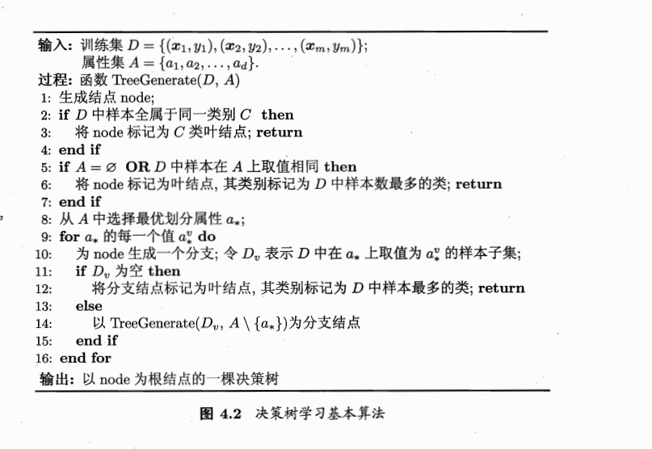
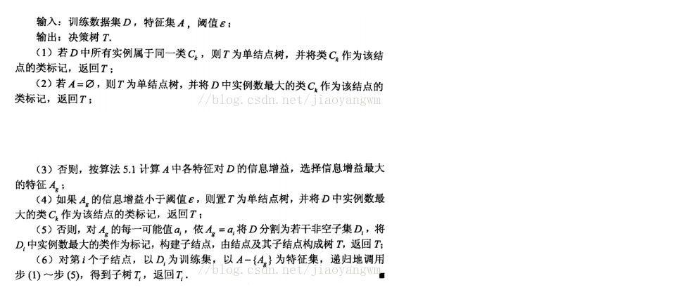
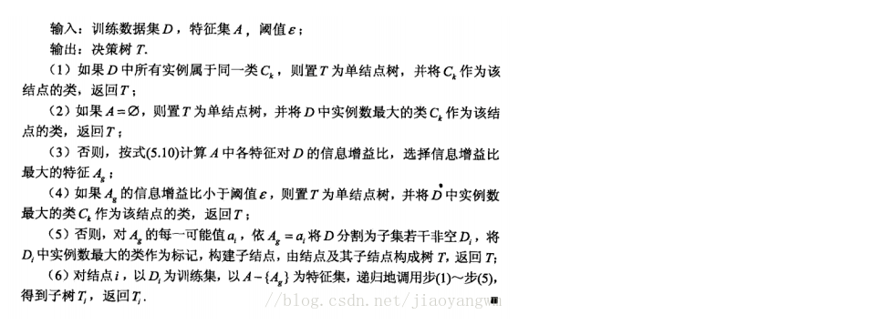
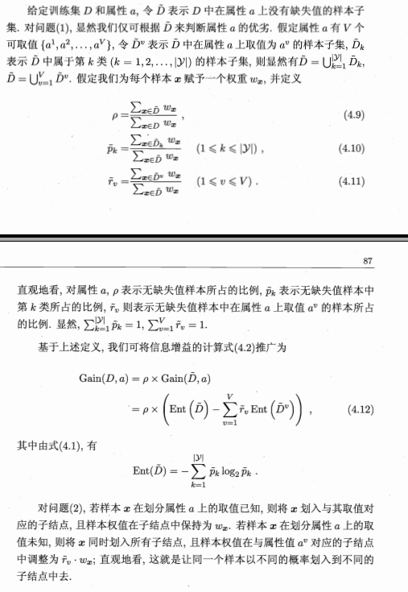

# 决策树

##决策树的构建

### 信息增益

“ 信息熵"( information entropy)是度量样本集合纯度最常用的一种指标.假定当前样本集合D中第k 类样本所占的比例为$p_k$（ k =  1,2,… ,$|y|$ ) , 则 D的信息嫡定义为$Ent(D)=-\sum_{k=1}^{|y|}p_klog_2p_k$
Ent(D)的值越小,则D的纯度越高.

假定离散属性a有V个可能的取值${a^1,a^2,a^3...,a^V}$。若使用a来对样本集D进行划分，则会产生V个分支结点，其中第v个分支结点包含了D中所有在属性a 上取值为$a^V$的样本，记为$D^v$我们可根据信息熵公式计算出$D^v$的信息嫡,再考虑到不同的分支结点所包含的样本数不同,给分支结点赋予权重$\frac{D^v}{D}$,即样本数越多的分支结点的影响越大,于是可计算出用属性a对样本集D进行划分所获得的“ 信息增益”( information gain)
$Gain(D,a) = Ent(D)-\sum_{v=1}^{V}\frac{D^v}{D}Ent(D^v)$
一般而言,信息增益越大,则意味着使用属性a 来进行划分所获得的“ 纯度提升”越大.因此,我们可用信息增益来进行决策树的划分属性选.

### ID3算法

对于特征$a_*$的选择，基于信息增益的角度来进行特征选择的为ID3算法。

### C4.5算法

由于ID3算法偏向于分类种类多的特征，这样会使得决策树的泛化能力不强，故根据增益率来划分最优属性。

增益率定义为：

$Gain\_ration(D,a) = \frac{Gain(D,a)}{IV(a)}$ 

其中 $IV(a) = - \sum_{v=1}^{V}\frac{D^v}{D}log_2\frac{D^v}{D}$

$IV(a)$称为a的“固有值”。

需注意的是，增益率准则对可取值数目较少的属性有所偏好，因此C4.5算法并不是直接选择增益率最大的候选划分属性，而是使用了一个启发式.先从候选划分属性中找出信息增益高于平均水平的属性，再从中选择增益率最高的。

### CART决策树

CART决策树使用“基尼指数”来选择划分数据。

数据集D的纯度可用基尼系数来度量：

$Gini(D)=\sum_{k=1}^{|y|}\sum_{k^{'}≠k}p_kp_{k^{'}}=1-\sum_{k=1}^{|y|}p_k^2$

直观来说,Gini(P)反映了从数据集D中随机抽取两个样本,其类别标记不一致的概率.因此,Gini(D)越小,则数据集D的纯度越高。

属性a的基尼指数定义为

$Gini\_index(D,a)=\sum_{v=1}^{V}\frac{D^v}{D}Gini(D^v)$
于是,我们在候选属性集合A中,选择那个使得划分后基尼指数最小的属性作为最优划分属性,即

$a_*= argmin_{a∈A}Gini.index(D, a)$

## 剪枝

为防止决策树过拟合化，故使用剪枝操作。预剪枝在生成整个树之前，后剪枝在生成整个树之后，当时剪枝的策略都是比较正确率（在该特征下，以种类数目最多的作为结果，比较分类错误率）。

### 预剪枝

预剪枝是指在决策树生成过程中，对每个结点在划分前先进行估计，若当前结点的划分不能带来决策树泛化性能提升，则停止划分并将当前结点标记为叶结点。

预剪枝使得决策树的很多分支都没有“ 展开”，这不仅降低了过拟合的风险，还显著减少了决策树的训练时间开销和测试时间开销.但另一方面，有些分支的当前划分虽不能提升泛化性能、甚至可能导致泛化性能暂时下降， 但在其基础上进行的后续划分却有可能导致性能显著提高； 预剪枝基于“ 贪心”本质禁止这些分支展开，给预剪枝决策树带来了欠拟合的风险。

### 后剪枝

后剪枝则是先从训练集生成一棵完整的决策树,然后自底向上地对非叶结点进行考察，若将该结点对应的子树替换为叶结点能带来决策树泛化性能提升，则将该子树替换为叶结点。

后剪枝决策树通常比预剪枝决策树保留了更多的分支.一般情形下，后剪枝决策树的欠拟合风险很小，泛化性能往往优于预剪枝决策树.但后剪枝过程是在生成完全决策树之后进行的，并且要自底向上地对树中的所有非叶结点进行逐一考察，因此其训练时间开销比未剪枝决策树和预剪枝决策树都要大得多。

## 连续与缺失值

### 连续值

给定样本集D和连续属性a,假定a在D上出现了n个不同的取值,将这些值从小到大进行排序， 记为${a^1,a^2,...a^n}$.基于划分点t可将D分为子集$D_t^-$和$D_t^+$其中$D_t^-$包含那些在属性a上取值不大于t 的样本,而$D_t^+$则包含那些在属性a 上取值大于t的样本.显然,对相邻的属性取值$a^i$与$a^{i+1}$来说,t在区间$[a^i,a^{i+1})$中取任意值所产生的划分结果相同.因此,对连续属性a,我们可考察包含n-1个元素的候选划分点集合

$T_a =\{\frac{a^i+a^{i+1}}{2}|i≤i≤n-1\}$

即把区间$[a^i,a^{i+1})$的中位数$\frac{a^i+a^{i+1}}{2}$作为候选划分点.然后,我们就可像离散属性值一样来考察这些划分点,选取最优的划分点进行样本集合的划分.

$Gain(D,a)= max_{t∈T_a}Gain(D,a,t) = maxx_{t∈T_a}\ Ent(D)\ -\ \sum_{\lambda∈\{-,+\} }\frac{|D_t^{\lambda}|}{|D|}Ent(D_t^{\lambda})$

其中$Gain(D,a,t)$是样本集D基于划分点t 二分后的信息增益.于是,我们就可选择使Gain(D,a,t)最大化的划分点。

### 缺失值处理

(1)如何在属性值缺失的情况下进行划分属性选择?

(2)给定划分属性，若样本在该属性上的值缺失,如何对样本进行划分？

