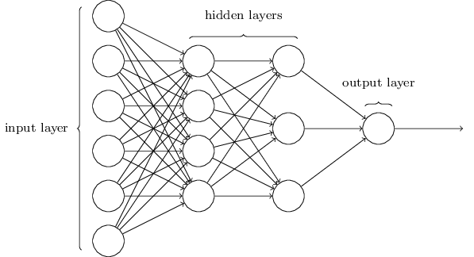
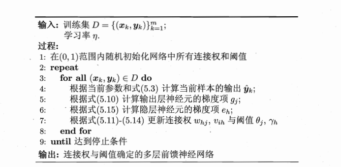

# 神经网络

## 神经细胞的模型化

神经元：多个输入---->权重--->偏置--->激励函数--->输出
符号表示：x为输入函数，W为权重，b为偏置常量，f为激励函数，y为输出
则$y=f（∑（x_i * w_i+b)）$

## 神经元的网络化

在神经网络中，网络层包括`输入层`，`中间层（隐藏层）`，`输出层`。
正向传播：从转递输入信息到产生输出的过程
反向传播：从输出向输入逆向传递信息的过程
符号表示：
前面网络层有m个，后面网络层有n个。则Wij：前面网络层i对后面网络层j的权重，W为m *n的矩阵。
上层网络层有m个神经元，即上层网络的输出向量的元素为m。
i作为上层网络的下标，j作为下层网络的下标。
$Y_i=X_j=(x_1,x_2,x_3...x_m)$ *下层网络层的每一个神经元都有m个输入*
下层神经网络的神经元偏置$B_j=（b_1，b_2,b_3...b_n)$

下层神经网络的输出为$Y_j=(y_1,y_2,y_3...y_n)$

则$Yj=f（\sum(X_j *W_{ij})+B_j)$

## 误差传播算法

输出层：

- 偏置的梯度
- 权重的梯度
- 输入的梯度

中间层：

- 偏置的梯度
- 权重的梯度
- 输入的梯度

| 网络层  | 下表   | 神经元数量 |
| ---- | ---- | :---- |
| 输入层  | i    | l     |
| 中间层  | j    | m     |
| 输出层  | k    | n     |

#### 输出层的梯度

##### 相关函数

$ E=f_1(y_k)$

$y_k=f_2(u_k)$

$u_k=\sum_{q=1}^{m}(y_qw_{qk}+b_k)$

E:损失值

$f_1$:损失函数

$y_k$:输出结果

$f_2$:激励函数

$u_k$:输入与权值乘积与偏置的求和

$y_j$:$y_j$为$y_q$中的一个

##### 定义

$\delta_k=\frac{∂E}{∂u_K}=\frac{\partial E}{\partial y_k}\frac{\partial y_k}{\partial u_k}$

$\frac{\partial E}{\partial y_k}$损失函数对$y_k$的偏微分

$\frac{\partial y_k}{\partial u_k}$激励函数对$u_k$的偏微分

##### 输出层权重的梯度

$\partial w_{jk} = \frac{\partial E}{\partial w_{jk}}$

根据微分连锁公式

$\frac{\partial E}{\partial w_{jk}}=\frac{\partial E}{\partial y_k}\frac{\partial y_k}{\partial u_k}\frac{\partial u_k}{\partial w_{jk}}$

$\frac{\partial u_k}{\partial w_{jk}}=y_j$   :$u_k$对$w_{jk}$的偏微分

$\partial w_{jk} =\delta_ky_j$

##### 输出层偏置的梯度

$\partial b_k = \frac{\partial E}{\partial b_k}$

根据微分连锁公式

$\frac{\partial E}{\partial b_k}=\frac{\partial E}{\partial y_k}\frac{\partial y_k}{\partial u_k}\frac{\partial u_k}{\partial b_k}$

$\frac{\partial u_k}{\partial b_k}=1$  : $u_k$对$b_k$的偏微分

$\partial b_k =\delta_k$

#### 输出层的输入梯度

输出层的输入梯度=中间层的输出梯度

$\partial y_j= \frac{\partial E}{\partial y_j}$

根据微分连锁公式

$\frac{\partial E}{\partial y_j}=\sum_{r=1}^{n}\frac{\partial E}{\partial y_r}\frac{\partial y_r}{\partial u_r}\frac{\partial u_r}{\partial y_j}$

$\frac{\partial u_r}{\partial y_j}=w_{jr}$

$\partial y_j=\sum_{r=1}^{n}\delta_rw_{jr}$

#### 中间层的梯度

##### 相关函数

$y_j=f(u_j)$

$u_j=w_{ij}y_i+b_j$

$y_j$为中间层的输出值

$f$为激励函数

$u_j$输入值与权重的乘积与偏置的和

##### 中间层权重的梯度

$∂ w_{ij}=\frac{∂ E}{∂ w_{ij}}=\frac{∂ E}{∂ uj}\frac{∂{u_j}}{∂ w_{ij}}=\frac{∂ E}{∂ y_j}\frac{∂ y_j}{∂ u_j}\frac{∂ u_j}{∂ w_{ij}}$

$\frac{∂ E}{∂ y_j}$为中间层的输出梯度

$\frac{∂ y_j}{∂ u_j}$为激励函数的微分

$\frac{∂ u_j}{∂ w_{ij}}=y_i$

定义$\delta_j=∂ y_i\frac{∂ y_j}{∂ u_j}$则$∂ w_{ij}=yi\delta_j$

##### 中间层偏置的梯度

$∂ b_j=\frac{∂ E}{∂ b_j}=\frac{∂ E}{∂ uj}\frac{∂{u_j}}{∂ b_j}$

$\frac{∂{u_j}}{∂ b_j}=1$

则$ b_j=\delta_j$

若网络层不止三层，即隐藏层不止三层，则$∂ y_i=\sum_{q=1}^{m}∂_qw_{iq}$

#### 梯度计算公式总结

##### 输出层

$\delta_k=\frac{\partial E}{\partial u_k}=\frac{\partial E}{\partial y_k}\frac{\partial y_k}{\partial u_k}$

$\partial w_{jk} =y_j\delta_k$

$\partial b_k =\delta_k$

$\partial y_j=\sum_{r=1}^{n}\delta_rw_{jr}$

关于$\delta_k$的求解，在使用不同的损失函数和激励函数组合时不同，其方法也是不同的，$\delta_k$与输出层的神经元数量相同

##### 中间层

$\delta_j=\frac{∂ E}{∂ u_j}=∂ y_i\frac{∂ y_j}{∂ u_j}$

$∂ w_{ij}=y_i\delta_j$

$∂ b_j=\delta_j$

$∂ y_i=\sum_{q=1}^{m}\delta_qw_{iq}$

> BP算法的目标是要最小化训练集D上的累积误差$E = \frac{1}{m}\sum_{k=1}^{m}E_k$

## 全局最小与局部最小

在现实任务中，人们常采用以下策略来试图“ 跳出”局部极小，从而进一步接近全局最小：
•以多组不同参数值初始化多个神经网络，按标准方法训练后，取其中误差最小的解作为最终参数.这相当于从多个不同的初始点开始搜索，这样就可能陷入不同的局部极小，从中进行选择有可能获得更接近全局最小的结果.
•使用“模拟退火"(simulated annealing)技术，模拟退火在每一步都以一定的概率接受比当前解更差的结果，从而有助于 “ 跳出”局部极小.在每步迭代过程中，接受“次优解”的概率要随着时间的推移而逐渐降低，从而保证算法稳定.
•使用随机梯度下降.与标准梯度下降法精确计算梯度不同，随机梯度下降法在计算梯度时加入了随机因素.于是，即便陷入局部极小点，它计算出的梯度仍可能不为零，这样就有机会跳出局部极小继续搜索.